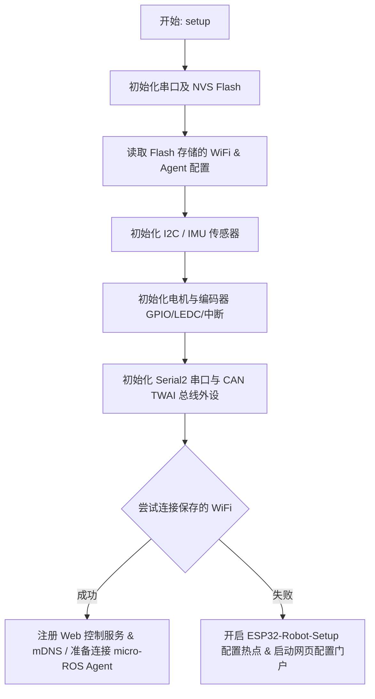

# ARCHITECTURE.md

本项目是一个基于 ESP32-S3 和 micro-ROS 架构的两轮差速机器人下位机固件工程。本文档详细记录了项目的代码结构、核心组件及其架构设计。

---

## 1. 项目目录结构 (Directory Structure)

```text
esp32-micro-ros-driver/
├── include/                 # 头文件目录
│   ├── encoder_reader.h     # 编码器读取与轮速计算
│   ├── motor_driver.h       # 电机驱动控制接口 (高频 PWM)
│   ├── pid_controller.h     # 速度 PID 闭环算法与前馈控制
│   ├── qmi8658_sensor.h     # QMI8658 六轴 IMU 驱动
│   ├── robot_app.h          # 机器人应用核心协调类
│   ├── robot_config.h       # 机器人硬件引脚及物理参数配置
│   ├── robot_types.h        # 核心数据结构与状态定义
│   ├── web_manager.h        # Web 服务、网页摇杆与配网接口
│   ├── web_pages.h          # 网页 HTML/CSS/JS 静态资源数据
│   └── wifi_config_manager.h# NVS Flash 配置读写与持久化
├── src/                     # 源代码目录
│   ├── encoder_reader.cpp
│   ├── main.cpp             # Arduino 入口 (setup & loop)
│   ├── motor_driver.cpp
│   ├── pid_controller.cpp
│   ├── qmi8658_sensor.cpp
│   ├── robot_app.cpp        # 核心控制与 ROS 通信实现
│   ├── web_manager.cpp      # Web 服务与 WebSocket 摇杆处理
│   └── wifi_config_manager.cpp # NVS 读写实现
├── test/                    # 测试及辅助资源
│   ├── README               # 测试说明
│   └── joystick.html        # 网页摇杆控制前端页面备份/设计稿
├── lib/                     # 第三方/自定义依赖库
├── platformio.ini           # PlatformIO 工程配置文件 (定义编译环境与依赖库)
└── README.md                # 项目简介与使用教程
```

---

## 2. 核心组件详解 (Core Components)

### 2.1 系统入口与协调层

*   **[main.cpp](file:///home/ranger/esp32-micro-ros-driver/src/main.cpp)**
    *   **作用**：Arduino 标准生命周期入口。
    *   **逻辑**：实例化全局唯一的 `robot::RobotApp`，在 `setup()` 中调用 `app.setup()` 进行硬件和网络初始化，在 `loop()` 中循环调用 `app.loop()` 处理任务调度。
*   **[robot_app.h](file:///home/ranger/esp32-micro-ros-driver/include/robot_app.h)** / **[robot_app.cpp](file:///home/ranger/esp32-micro-ros-driver/src/robot_app.cpp)**
    *   **作用**：系统的控制中枢，负责组织和协调传感器、执行器、网络以及 micro-ROS 节点。
    *   **主要职责**：
        1.  管理 micro-ROS Agent 的连接状态机 (`AgentState`)，处理连接断开与自动重连。
        2.  负责 micro-ROS 节点、发布者 (`odom`、`/tf`)、订阅者 (`cmd_vel`) 和定时器的生命周期（创建与销毁）。
        3.  执行核心控制定时器回调（通常为 50Hz/20ms 周期），在回调中读取编码器、运行 PID 速度环控制电机、计算轮式里程计并发布数据.
        4.  支持动态参数调整，如在线调整 PID 参数。

### 2.2 驱动与控制层

*   **[motor_driver.h](file:///home/ranger/esp32-micro-ros-driver/include/motor_driver.h)** / **[motor_driver.cpp](file:///home/ranger/esp32-micro-ros-driver/src/motor_driver.cpp)**
    *   **作用**：电机底层硬件驱动。通过 ESP32-S3 的 LEDC 外设产生高频 PWM 信号，控制电机驱动芯片（如 H 桥），支持方向取反设置。
*   **[encoder_reader.h](file:///home/ranger/esp32-micro-ros-driver/include/encoder_reader.h)** / **[encoder_reader.cpp](file:///home/ranger/esp32-micro-ros-driver/src/encoder_reader.cpp)**
    *   **作用**：编码器脉冲计数与滤波。通过硬件中断实时累加正交编码器脉冲，从而计算左右轮的实际旋转速度。
*   **[pid_controller.h](file:///home/ranger/esp32-micro-ros-driver/include/pid_controller.h)** / **[pid_controller.cpp](file:///home/ranger/esp32-micro-ros-driver/src/pid_controller.cpp)**
    *   **作用**：速度闭环控制器。采用位置式 PID 算法，结合前馈控制（Feedforward）和输出限幅，确保轮速快速、平稳地跟踪目标速度。

### 2.3 传感器层

*   **[qmi8658_sensor.h](file:///home/ranger/esp32-micro-ros-driver/include/qmi8658_sensor.h)** / **[qmi8658_sensor.cpp](file:///home/ranger/esp32-micro-ros-driver/src/qmi8658_sensor.cpp)**
    *   **作用**：IMU 姿态传感器驱动。通过 I2C 接口与板载 QMI8658 芯片通信，获取高频的六轴惯性数据（三轴加速度、三轴角速度），为上位机建图与导航提供姿态依据。

### 2.4 网络、Web 服务与配置管理

*   **[web_manager.h](file:///home/ranger/esp32-micro-ros-driver/include/web_manager.h)** / **[web_manager.cpp](file:///home/ranger/esp32-micro-ros-driver/src/web_manager.cpp)**
    *   **作用**：提供直观的本地 Web 控制面板和远程配网服务。
    *   **功能**：
        1.  **WiFi AP 配网门户**：连接失败或首次启动时开启 AP 热点，提供网页配置页面以设定 WiFi SSID、密码和 Agent 终结点。
        2.  **科技感 Web 控制端**：提供 HTML5 网页虚拟摇杆，通过 WebSocket 协议以约 20Hz 频率实时下发速度指令（已彻底移除串口的摇杆坐标日志打印，杜绝任何对 micro-ROS 串口数据流的污染风险）。
        3.  **多维度系统状态监控**：扩展 WebSocket 单向广播，除电压和电量外，还能在网页端实时展示 micro-ROS Agent 连接状态以及 Wi-Fi RSSI 信号强度等丰富信息。
        4.  **VOFA+ 调试持久化配置**：移除了主页的调试开关，将其整合到配置页面 (`WIFI_HTML`) 的表单中。支持保存到 NVS (Flash) 中以实现断电持久化（机器人每次开机均根据配置值决定是否输出 VOFA+ 流）。同时，串口 CLI（输入 `v:1` 或 `v:0`）依然支持动态开关输出，方便调试。
        5.  **安全急停 (E-Stop)**：网页端包含醒目的紧急制动按钮，按下后立即断开输出并锁定电机，摇杆输入失效；通信丢失时也会自动触发安全停车。
        6.  **局域网本地解析**：注册 mDNS (`esp32robot.local`) 和 NetBIOS (`esp32robot`)，无需记录 IP 即可直接在浏览器访问。
        7.  **OTA 空中固件升级**：支持通过局域网以无线方式更新固件。
*   **[web_pages.h](file:///home/ranger/esp32-micro-ros-driver/include/web_pages.h)**
    *   **作用**：存放网页控制终端（`INDEX_HTML`）和配置门户（`WIFI_HTML`）的静态 HTML/CSS/JS 原始字符串定义，从 C++ 业务逻辑中剥离以提高代码可维护性。
*   **[wifi_config_manager.h](file:///home/ranger/esp32-micro-ros-driver/include/wifi_config_manager.h)** / **[wifi_config_manager.cpp](file:///home/ranger/esp32-micro-ros-driver/src/wifi_config_manager.cpp)**
    *   **作用**：配置持久化管理器。使用 ESP32 专有的 NVS (Non-Volatile Storage) 读写接口，安全地将配置的 WiFi SSID、密码及 micro-ROS Agent IP、Port 存储在 Flash 中，断电不丢失。

### 2.5 配置与核心类型

*   **[robot_config.h](file:///home/ranger/esp32-micro-ros-driver/include/robot_config.h)**
    *   **作用**：定义机器人全局静态常量与出厂默认参数。包括引脚分配（已将 Serial1 调试引脚配置化为 `UART1_RX` / `UART1_TX` 统一管理）、LEDC PWM 频率及位数、物理结构参数（轮径、轴距、编码器线数）、PID 控制周期、超时阈值、以及默认的 ROS 话题名称和框架名称。此外，还包含了新 Serial2（TX=IO1, RX=IO2）和 CAN 接口（TX=IO6, RX=IO7）的引脚常量。
*   **[robot_types.h](file:///home/ranger/esp32-micro-ros-driver/include/robot_types.h)**
    *   **作用**：统一定义系统中使用的数据结构（如 IMU 采样数据结构 `ImuSample`、轮子测量结构 `WheelMeasurement`、网络配置结构 `NetworkConfig`、用以传递系统详细状态的 `SystemStatus` 结构体）以及 micro-ROS 状态机枚举 `AgentState`。

---

## 3. 系统核心流程 (System Flows)

### 3.1 初始化流程 (Setup Flow)


### 3.2 运行控制循环 (Control & Odom Loop)
在 `setup` 完成后，系统在 `loop()` 中通过 `controlTimer` 周期性执行以下任务：
1.  **轮速采样**：通过编码器计算出左右轮的实际物理速度（m/s）。
2.  **闭环计算**：将当前轮速与目标轮速输入到左、右 PID 控制器，计算输出值，并将其转换为高频 PWM 占空比作用于电机。
3.  **里程计积分**：利用两轮差速运动学模型对轮速进行时间积分，实时更新机器人在里程计坐标系下的二维位姿 $(x, y, \theta)$。
4.  **ROS 消息发布**：若 micro-ROS 连接正常，将位姿信息和当前的线速度/角速度填充进 `nav_msgs/msg/Odometry` 消息，并向 `/odom` 和 `/tf` 话题发布。
5.  **VOFA+ 调试波形输出**：若由 Web 端或串口开启了 VOFA+ 调试，会在循环周期末尾往 `Serial1` 写入实时的 JustFloat 数据帧（包含左右轮目标速度及测量速度），以供上位机调试分析。

### 3.3 控制权仲裁 (Command Precedence)
机器人的移动控制支持两个来源，其优先级与切换逻辑如下：
1.  **网页摇杆控制**：通过 Web 网页上的虚拟摇杆进行控制。当 WebSocket 连接活跃且有摇杆输入时，优先执行网页指令。如果检测到网页触发 E-Stop（急停）或 WebSocket 连接断开，会立即切断电机输出，触发安全停机。
2.  **micro-ROS 控制**：订阅 `/cmd_vel` 话题。当未处于网页控制模式或 E-Stop 锁定状态，且正常连接 Agent 时，接受上位机下发的速度指令。如果 `cmd_vel` 超过设定时间（如 100ms）未更新，固件会自动停车以策安全。

---

## 4. 编译与调试环境 (Build Environments)

工程在 [platformio.ini](file:///home/ranger/esp32-micro-ros-driver/platformio.ini) 中定义了四个编译环境，支持灵活的通信和烧录选择：

1.  **`esp32-s3-serial`**：使用 USB 串口与上位机 Agent 通信，有线烧录。
2.  **`esp32-s3-wifi`**：使用 WiFi (UDP) 与上位机 Agent 通信，有线烧录。
3.  **`esp32-s3-serial-ota`**：使用 USB 串口与上位机 Agent 通信，无线 OTA 烧录。
4.  **`esp32-s3-wifi-ota`**：使用 WiFi (UDP) 与上位机 Agent 通信，无线 OTA 烧录。
